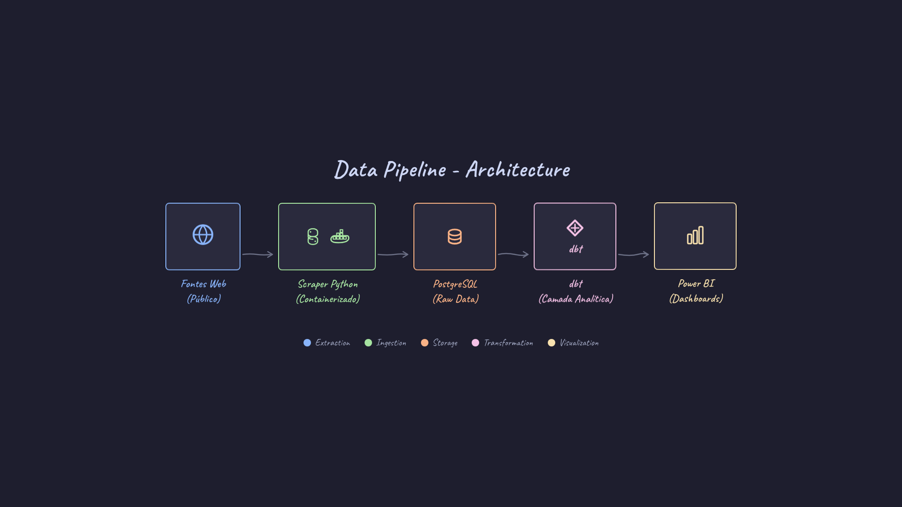

# Perfil { #perfil }

Meu nome é Wilkerson (ou Will), e atuo como Engenheiro de Dados com foco em **Engenharia Analítica**, conectando dados, contexto e negócio. Com formação em Análise de Sistemas e especializações em Engenharia e Ciência de Dados, meu trabalho consiste em construir e orquestrar pipelines que transformam dados brutos em soluções claras, escaláveis e que apoiam a tomada de decisão.

!!! quote "Sobre mim"
    *   :material-code-tags: &nbsp; Me pergunte sobre **Python, SQL, Engenharia de Dados e Power BI**.
    *   :material-heart: &nbsp; Coisas que eu gosto: **tecnologia, música, café e aprender algo novo**.
    *   :material-school: &nbsp; Especialista em **Engenharia de Dados** e pós-graduado em **Ciência de Dados & Big Data**.

---

# Projetos { #projetos }

Abaixo estão exemplos práticos de soluções de dados, desde a engenharia de pipelines até a entrega de aplicações analíticas para o negócio.

## 1. Pipeline para Monitoramento de Comércio Exterior

Este pipeline foi projetado para automatizar a coleta e a modelagem de dados de comércio exterior, superando o desafio de lidar com fontes públicas dispersas e formatos complexos.

A solução ingere, centraliza e transforma os dados brutos em uma camada analítica confiável, pronta para alimentar dashboards que monitoram tendências de mercado e o fluxo de mercadorias. O ambiente é totalmente containerizado com **Docker** para garantir reprodutibilidade, e a camada de transformação utiliza **dbt** para assegurar a qualidade e governança dos dados.

---

## 2. Data Applications (BI & Analytics)

### Painel da Nova Indústria Brasil (NIB)
Projeto de engenharia de dados para o monitoramento analítico da nova política industrial do Brasil.

▶ Ver Dashboard

<iframe title="Dashboard Nova Indústria Brasil" src="https://bit.ly/nib-missao-2"></iframe>

### Observatório da Micro e Pequena Empresa (MPE )
Solução analítica para a ABDI e MDIC, que centraliza dados públicos para embasar políticas de desenvolvimento.

▶ Ver Dashboard

<iframe title="Dashboard Observatório MPE" src="https://bit.ly/abdi-mpe"></iframe>

---

# Contato { #contato }

  
  
  

